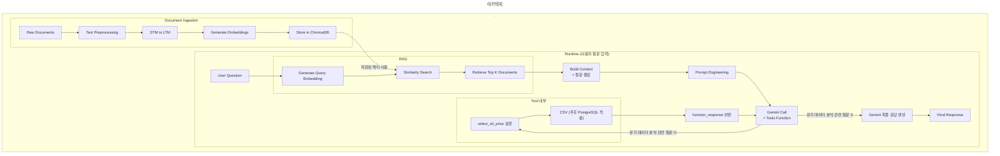

# rag_playground
RAG-powered news assistant built with Gemini, ChromaDB, Streamlit, and tool calling for regional gas price lookup.


# RAG LLM

경제 뉴스 기사와 유가 데이터를 근거로 질문에 답하는 한국어 RAG(검색 증강 생성) 기반 챗봇입니다. Gemini API의 Tool Calling(Function Calling) 기능을 활용해, 질문의 성격에 따라 **뉴스 semantic 검색**과 **유가 수치 조회**를 선택적으로 결합해 답변을 생성합니다.

---

## 목차

1. [프로토타입 소개](#프로토타입-소개)
2. [핵심 기능](#핵심-기능)
3. [기술 스택](#기술-스택)
4. [프로젝트 구조](#프로젝트-구조)
5. [시스템 아키텍처](#시스템-아키텍처)
6. [데이터 스키마 (STM / LTM)](#데이터-스키마-stm--ltm)
7. [RAG(검색 증강 생성) 구성](#rag검색-증강-생성-구성)
8. [LLM 및 Tool Calling](#llm-및-tool-calling)
9. [안정성 (재시도/에러 처리)](#안정성-재시도에러-처리)
10. [향후 계획](#향후-계획)

---

## 프로토타입 소개

국제 유가·환율 관련 뉴스와 국내 지역별 주유소 평균 판매가격 데이터를 함께 다루는 질의응답 시스템입니다. 사용자가 질문을 하면, LLM이 스스로 판단해 뉴스 검색과 가격 데이터 조회 중 필요한 것만(또는 둘 다) 수행한 뒤 근거를 밝히며 답변합니다.

핵심 설계 목표는 다음과 같습니다.

- **근거 기반 답변**: 모델이 임의로 생성한 정보가 아니라, 실제 뉴스 벡터 검색 결과와 CSV 기반 실측 가격 데이터에 근거해 답변
- **선택적 Tool 호출**: 뉴스 맥락이 필요 없는 질문에는 벡터 검색을 생략하고, 가격 수치가 필요 없는 질문에는 CSV 조회를 생략
- **무료 티어 제약 대응**: Gemini API 무료 tier의 호출 제한(429)과 서버 과부하(503)에 대비한 재시도 로직 내장

## 핵심 기능

| 기능 | 설명 |
|---|---|
| 뉴스 semantic 검색 | 사용자 질문을 임베딩해 ChromaDB에 저장된 뉴스 기사와 유사도 기반 검색 |
| 지역별 유가 조회 | 날짜 범위·지역을 지정해 주유소 평균 판매가격(원/리터) 조회 |
| 복합 질의 대응 | 뉴스와 가격 데이터가 모두 필요한 질문은 두 Tool을 모두 호출해 결과 종합 |

## 기술 스택

- **LLM / Embedding**: Google Gemini API
- **벡터 DB**: ChromaDB
- **데이터 처리**: Python, Pandas
- **설정 관리**: .env (깃 업로드 금지)

## 프로젝트 구조

```
Risk AI Agent/
│   chatbot.py        # 챗봇
│   .env.example        # 설정 관리 예시
├── utils/
│   ├── db_utils.py        # ensure_ltm_vector_collection 등 ChromaDB 연결/컬렉션 관리
│   └── chat_utils.py       # chroma_hits, format_ltm_hit_for_chatbot 등 검색 결과 가공
├── STM_to_LTM.ipynb         # STM → LTM 및 ChromaDB upsert 파이프라인
├── data/
│   └── 주유소_지역별_평균판매가격.csv
│   └── chroma_db/           # ChromaDB PersistentClient 영속 저장 경로
```

> streamlit 관련 구조 및 실행 방법은 별도 문서에서 다룹니다.

## 시스템 아키텍처

### 전체 흐름도

```
[뉴스 원본 수집]
      │  스키마에 맞춰 가공
      ▼
[STM (Short-Term Memory) 파일]
      │ 동일 세션 STM을 LTM 으로 가공
      ▼
[LTM (Long-Term Memory) 파일]
      │  임베딩 생성 후 upsert
      ▼
[ChromaDB PersistentClient 컬렉션]
      │  semantic search (news_search Tool)
      ▼
┌─────────────────────────────────────────┐
│              Gemini LLM                 │
│  system_instruction + Tool 판단/호출      │
│  ┌───────────────┐   ┌──────────────────┐│
│  │  news_search   │   │ select_oil_price ││
│  │ (ChromaDB 검색) │   │ (CSV 가격 조회)   ││
│  └───────────────┘   └──────────────────┘│
└─────────────────────────────────────────┘
      │
      ▼
   최종 답변 (근거 출처 명시)
```

### 데이터 파이프라인

1. **수집**: 뉴스 원문 데이터를 수집
2. **가공**: 수집한 뉴스 원문 데이터를 STM 스키마에 맞춰 가공 후 STM 파일로 저장 
3. **임베딩 & 적재**: LTM 파일을 임베딩 모델로 벡터화 후 ChromaDB 컬렉션에 upsert
4. **조회**: 챗봇 실행 시점에는 별도의 오프라인 배치 작업 없이, 사용자 질문을 실시간으로 임베딩해 기존에 적재된 컬렉션에서 검색만 수행

> 파이프라인과 챗봇 실행 시점은 분리되어 있습니다. `STM_to_LTM.ipynb`는 적재 스크립트이고, 챗봇은 이미 적재된 ChromaDB 컬렉션을 읽기 전용으로 조회합니다.

### 멀티 레이어 메모리 구조

| 레이어 | 역할 |
|---|---|
| **STM (Short-Term Memory)** | 원본/최신 수집 데이터. 세션(`session_id`) 단위로 여러 기사(`articles`)를 묶어 저장 |
| **LTM (Long-Term Memory)** | 동일 세션 내 article들을 주제(topic)별로 클러스터링해 요약한 데이터. ChromaDB에 upsert되는 단위 |

## 데이터 스키마 (STM / LTM)

### STM 스키마

수집된 뉴스 원본을 1차 가공한 결과입니다.

| 필드명 | 타입 | 설명 |
|---|---|---|
| `session_id` (최상위) | string | 세션(수집 배치) 단위 식별자. 하나의 세션에 여러 기사(`articles`)가 묶임 |
| `articles[].id` | string | 개별 기사(article) 고유 식별자 |
| `articles[].memory_type` | string | 고정값 `"stm"` |
| `articles[].session_id` | string | 소속 세션 ID (최상위 `session_id`와 동일 값을 article마다 복사) |
| `articles[].title` | string | 기사 제목 |
| `articles[].link` | string | 원문 링크 (`originallink`) |
| `articles[].description` | string | 기사 본문 요약/설명 |
| `articles[].pubDate` | string (`%Y-%m-%d %H:%M:%S %z`) | 기사 발행일시 |
| `articles[].turn_index` | integer | 세션 내 기사 순서 |
| `articles[].author` | string | 언론사/작성자 |
| `articles[].category` | string | 기사 카테고리 |

### LTM 스키마

동일 세션 내 article들을 클러스터링해 하나 이상의 레코드로 압축한 구조입니다.

| 필드명 | 타입 | 설명 |
|---|---|---|
| `id` | string | LTM 레코드 고유 식별자. `{session_id}_ltm_{n}` 형식 (예: `2b752099_ltm_1`, `2b752099_ltm_2`) |
| `session_id` | string | 원본 STM 세션 ID. |
| `summary` | string | 같은 주제로 묶인 STM article들을 요약한 문장. ChromaDB에 임베딩되는 본문(`document`)으로 사용됨 |
| `topic_tags` | array[string] | 기사를 검색과 챗봇 응답에 바로 쓸 수 있는 짧은 한국어 태그 배열 |
| `source_message_ids` | array[string] | 이 요약을 구성한 원본 STM article `id` 목록 |
| `source_turn_indices` | array[integer] | 이 요약을 구성한 원본 STM article `turn_index` 목록 |
| `pubDate` | string (`YYYY-MM-DD`) | 세션에 속한 article들의 공통 발행일 (세션은 항상 하루치 수집 배치이므로 세션 내 article들의 발행일은 모두 동일함) |

## RAG(검색 증강 생성) 구성

### 임베딩 및 벡터 검색

- 임베딩 모델: `gemini-embedding-001`
- 질문 텍스트를 임베딩 벡터로 변환한 뒤, ChromaDB 컬렉션에서 `3` 개의 최근접 문서를 조회
- 검색 결과는 `documents`, `metadatas`, `distances`를 함께 반환받아 근거 문서와 유사도(거리)를 함께 확인 가능

### ChromaDB 설정

- 클라이언트: `chromadb.PersistentClient` — 디스크에 영속화된 컬렉션을 사용해 재시작 시에도 재구축 불필요
- 날짜 필터링: 메타데이터 `pubDate` 필드에 대해 `$gte`/`$lte` 연산자로 기간 조건 적용
  ```python
  where_filter = {"$and": [{"pubDate": {"$gte": start_date}}, {"pubDate": {"$lte": end_date}}]}
  ```
- 컬렉션이 비어 있는 경우(`count() == 0`)에는 검색을 생략하고 빈 결과를 반환해 불필요한 API 호출을 방지

## LLM 및 Tool Calling

### 사용 모델

- `CHATBOT_MODEL`: `gemini-3.5-flash` — 실제 대화 응답 생성에 사용하는 모델
- `PROMOTION_MODEL`: `gemini-3.5-flash` — 승격/분류 등 보조 판단에 활용

### Tool 정의

**1) `news_search`** — 뉴스 semantic 검색

| 파라미터 | 필수 | 설명 |
|---|---|---|
| `query` | ✅ | 검색할 질문/키워드 |
| `start_date` | – | 검색 시작일 (YYYY-MM-DD) |
| `end_date` | – | 검색 종료일 (YYYY-MM-DD) |

**2) `select_oil_price`** — 지역별 유가 조회

| 파라미터 | 필수 | 설명 |
|---|---|---|
| `start_date` | ✅ | 조회 시작일 (YYYY-MM-DD) |
| `end_date` | ✅ | 조회 종료일 (YYYY-MM-DD) |
| `regions` | – | 조회할 지역 목록 (생략 시 전체) |

두 Tool은 `TOOL_REGISTRY` 딕셔너리에 등록되어 있으며, 실제로 어떤 Tool을 호출할지는 `system_instruction`에 따라 Gemini가 판단합니다. 뉴스와 가격 정보가 모두 필요한 질문에는 두 Tool을 순차적으로 모두 호출한 뒤 결과를 종합합니다.

### Tool 호출 처리 흐름

1. 사용자 질문을 `contents`에 담아 `generate_content` 호출
2. 응답에 `function_call` 파트가 있으면 해당 Tool 함수를 실행
3. 실행 결과를 `function_response`로 감싸 다시 모델에 전달
4. `function_call`이 더 이상 없을 때까지 반복 → 최종 텍스트 응답 반환

Tool 실행 중 예외가 발생하면 `{"error": ...}` 형태로 감싸 모델에 전달해, 해당 Tool 호출 실패만으로 전체 응답이 중단되지 않도록 처리합니다. 단, API 재시도까지 모두 소진한 경우(`APIError`)는 상위로 그대로 전파됩니다.

## 안정성 (재시도/에러 처리)

Gemini 무료 tier 사용 시 자주 발생하는 두 가지 에러에 대한 재시도 로직을 공통 유틸(`call_with_retry`)로 분리했습니다.

| 상태 코드 | 의미 | 처리 |
|---|---|---|
| `429` | 호출 횟수 초과 (RESOURCE_EXHAUSTED) | 지수 백오프 + 지터로 재시도 |
| `503` | 서버 과부하 | 지수 백오프 + 지터로 재시도 |
| 그 외 (400, 403, 404 등) | 요청/권한 오류 | 재시도 없이 즉시 예외 전파 |

- 기본 최대 재시도 횟수: 5회
- 대기 시간: `base_delay * 2^attempt` (최대 `max_delay`) + 지터(랜덤 값)로 동시 재시도 충돌 완화
- 최대 재시도 초과 시 마지막 에러를 포함한 `RuntimeError`로 명확히 실패 처리

## 향후 계획
AI 데이터 파이프라인 확장
- [ ] Airflow로 뉴스 데이터 매일 적재하기
- [ ] 현재는 유가 데이터를 csv 로 제공하고 있지만 추후 postgresql 을 조회하여 데이터 조회하도록 `select_oil_price` 변경

### 아키텍처


